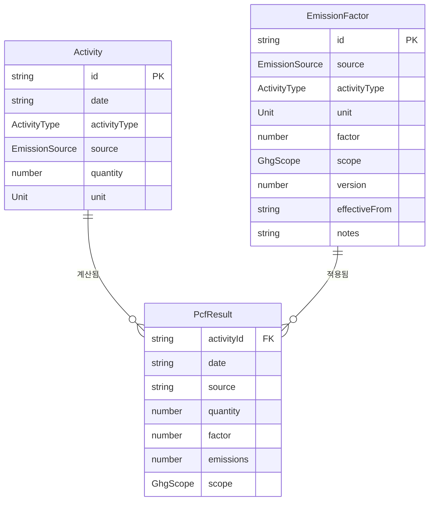

# Carbon Dashboard — Hanaloop 채용 과제

PCF(Product Carbon Footprint) 전과정 데이터를 시각화하는 인터랙티브 대시보드입니다.  
실무자·경영자가 활동 데이터를 입력하면 GHG Protocol 기준으로 탄소 배출량을 자동 계산합니다.

---

## 실행 방법

```bash
# 1. 저장소 클론
git clone https://github.com/Chodongdong/carbon-dashboard.git
cd carbon-dashboard

# 2. 패키지 설치
yarn install

# 3. 개발 서버 실행
yarn dev
```

브라우저에서 http://localhost:3000 접속

```bash
# 프로덕션 빌드 실행 (선택)
yarn build && yarn start
```

> Node.js 18+ 필요. yarn이 없으면 `npm install -g yarn` 먼저 실행.

---

## 화면 구성

| 경로 | 설명 |
|------|------|
| `/` | 대시보드 — KPI 카드, 월별 트렌드, Scope 분포, 활동 유형별 차트 |
| `/activities` | 활동 데이터 입력·수정·삭제, Excel 임포트 |
| `/emissions` | PCF 계산 결과 상세·월별 요약, Scope 필터 |
| `/emission-factors` | 배출계수 관리, 버전 이력 추적 |

---

## PCF 계산 방식

```
배출량 (kgCO₂e) = 활동량 × 배출계수
```

| 활동 유형 | 출처 | 배출계수 | GHG Scope |
|-----------|------|----------|-----------|
| 전기 | 한국전력 | 0.456 kgCO₂e / kWh | Scope 2 |
| 원소재 | 플라스틱 1 | 2.3 kgCO₂e / kg | Scope 3 |
| 원소재 | 플라스틱 2 | 3.2 kgCO₂e / kg | Scope 3 |
| 운송 | 트럭 | 3.5 kgCO₂e / ton-km | Scope 3 |

**Scope 분류 기준 (GHG Protocol)**
- **Scope 2**: 구매 전력 등 간접 에너지 배출
- **Scope 3**: 원소재 조달(Upstream), 제품 운송(Downstream) 등 가치사슬 배출

---

## 시스템 설계

### 아키텍처 개요

```
┌─────────────────────────────────────────────────────┐
│                   Next.js App Router                 │
│                                                      │
│  /  →  DashboardPage   (PCF 요약 시각화)             │
│  /activities →  ActivitiesPage  (CRUD + Excel)       │
│  /emissions  →  EmissionsPage   (계산 결과)           │
│  /emission-factors → FactorsPage (계수 관리)          │
└──────────────┬──────────────────────────────────────┘
               │ useMemo (파생 데이터)
┌──────────────▼──────────────────────────────────────┐
│              Zustand Store (useDataStore)             │
│  activities[]  emissionFactors[]  상태/에러/로딩      │
└──────────────┬──────────────────────────────────────┘
               │ fetch / mutate
┌──────────────▼──────────────────────────────────────┐
│              lib/api.ts  (가짜 백엔드)                │
│  지연 200–800ms + 간헐적 실패 15% 시뮬레이션          │
└──────────────┬──────────────────────────────────────┘
               │
┌──────────────▼──────────────────────────────────────┐
│              lib/pcf.ts  (순수 계산 함수)             │
│  calculatePcf / aggregateByMonth / aggregateByScope  │
└─────────────────────────────────────────────────────┘
```

### 상태 경계

| 상태 종류 | 위치 | 이유 |
|-----------|------|------|
| 레이아웃 (드로어 open/close) | `useLayoutStore` | 여러 컴포넌트에서 공유 |
| 서버 데이터 (activities, factors) | `useDataStore` | 전역, 캐시 역할 |
| 페이지 UI (필터, 모달, 탭) | 각 페이지 `useState` | 페이지 범위에서만 유효 |
| PCF 계산 결과 | `useMemo` (파생) | 저장 불필요, 원본에서 계산 |

### 렌더링 효율성

- PCF 계산(`calculatePcf`)은 `useMemo`로 감싸 activities·emissionFactors가 바뀔 때만 재계산
- 월별/Scope별 집계도 각각 `useMemo` 분리 → 필터 변경 시 전체 재계산 방지
- 낙관적 업데이트: 수정·삭제 즉시 UI 반영 후 API 실패 시 이전 상태 롤백

### 데이터 흐름

```
Excel 파일 업로드
    → xlsx 파싱 (lib/ExcelImport)
    → 컬럼 매핑 (활동 유형 / 출처 / 단위)
    → createActivity() 순차 호출
    → Zustand store 업데이트
    → useMemo 재계산
    → 차트·테이블 자동 갱신
```

---

## 데이터 스키마



---

## 설계 결정 및 Trade-off

### 1. 가짜 백엔드 + 인메모리 상태

**결정**: 실제 DB 없이 `lib/api.ts`에서 지연·실패를 시뮬레이션  
**이유**: 과제 범위 내에서 로딩·에러·롤백 동작을 실제와 동일하게 검증 가능  
**Trade-off**: 새로고침 시 데이터 초기화. 실제 서비스라면 API Route + PostgreSQL로 교체.

### 2. PCF를 파생 상태(useMemo)로 관리

**결정**: PCF 결과를 별도 저장 없이 activities × emissionFactors에서 매번 계산  
**이유**: 배출계수가 변경되면 모든 과거 데이터의 PCF도 즉시 재계산되어 일관성 유지  
**Trade-off**: 데이터 규모가 수만 건 이상이면 Web Worker 분리 필요.

### 3. 무거운 UI 라이브러리 미사용

**결정**: Tailwind + 직접 구현한 Button·Badge·Skeleton 컴포넌트  
**이유**: 번들 크기 최소화, 디자인 시스템을 직접 제어  
**Trade-off**: 접근성(a11y) 처리를 직접 해야 함.

---

## 기술 스택

| 항목 | 선택 |
|------|------|
| Framework | Next.js 16 (App Router) + React 19 |
| Language | TypeScript |
| Styling | Tailwind CSS v4 |
| 차트 | Recharts |
| 상태 관리 | Zustand v5 |
| 폼 · 검증 | React Hook Form + Zod v4 |
| Excel 파싱 | SheetJS (xlsx) |
| 테스트 | Vitest + @testing-library/react |

---

## 테스트 실행

```bash
yarn test
```

`src/lib/__tests__/pcf.test.ts` — PCF 계산 로직 단위 테스트 7개  
전기(0.456), 플라스틱1(2.3), 트럭(3.5) 배출계수 계산 검증 포함

---

## AI 도구 사용 내역

본 과제는 **Claude (Anthropic)** 를 활용하여 개발했습니다.

| 작업 | AI 활용 내용 | 직접 판단한 부분 |
|------|-------------|----------------|
| 프로젝트 설계 | 전체 폴더 구조 및 컴포넌트 분리 제안 | Scope 분류 기준(GHG Protocol), 배출계수 매핑 방식 도메인 판단 |
| 타입 정의 | Activity, EmissionFactor, PcfResult 타입 초안 | 버전 이력 추적 필드 추가 결정 |
| PCF 계산 로직 | `calculatePcf`, `aggregateByMonth` 함수 구현 | 반올림 정밀도(3자리), 파생 상태로 관리할지 결정 |
| 가짜 API | 지연·실패 시뮬레이션 구조 | 실패율 15%, 낙관적 업데이트 + 롤백 패턴 결정 |
| UI 컴포넌트 | Button, Badge, Skeleton, 차트 컴포넌트 코드 | 색상 팔레트(emerald·blue·purple), Scope별 색상 규칙 |
| Excel 임포트 | SheetJS 파싱 로직 | CT-045 컬럼명 매핑 규칙, 스킵 처리 방식 |

**사용 프롬프트 방식**: 기능 단위로 구체적인 요구사항을 지정하고 코드 생성 → 직접 검토 후 타입 오류·로직 수정

---

## 작업 소요 시간

| 단계 | 소요 시간 |
|------|----------|
| 요구사항 분석 + 설계 | 1h |
| 프로젝트 셋업 + 타입·데이터·API | 1h |
| 레이아웃·공통 컴포넌트 | 1h |
| 대시보드 메인 페이지 | 1.5h |
| 활동 데이터 페이지 + Excel 임포트 | 1.5h |
| PCF 결과·배출계수 페이지 | 1h |
| README | 0.5h |
| **합계** | **약 7.5h** |
